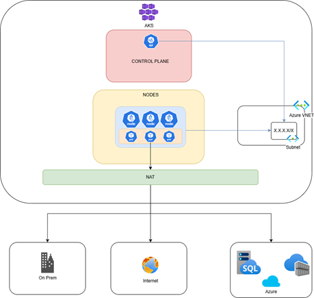
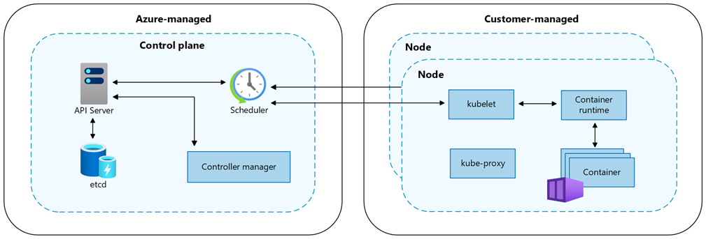
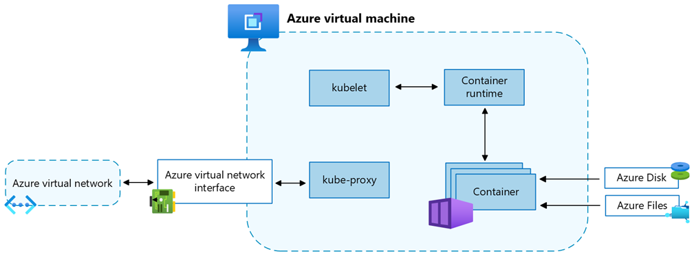
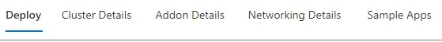
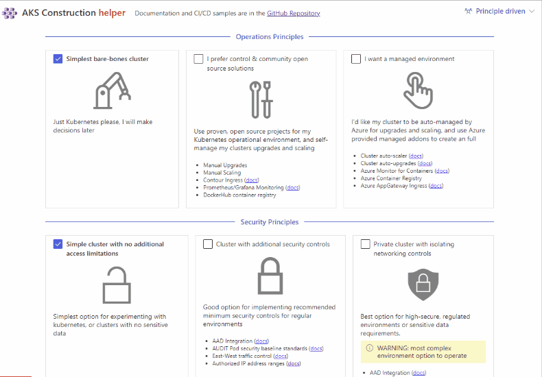

# AKS Quick Guide 

## Introduction

The present document provides simple guidance on recommendations, design, implementation, and validation processes related to the configuration of Azure Kubernetes Service (AKS) resources as a container orchestration platform. Additionally, it includes security best practices and hardening guidelines to strengthen the overall security posture of AKS clusters.
The purpose of this document is to serve as a foundation for understanding recommended configurations, best practices, and governance of AKS using Microsoft Azure native tools.

> [!IMPORTANT]
> This is a quick guide to deploy AKS following best practices and recommendations, ease of use, ENJOY :sunglasses:.
>
> Take a test run now from [Azure Portal Cloud Shell](https://portal.azure.com/#cloudshell)!

> [!NOTE]
> If your project requires specific configurations or unique features, the AKS Helper can be used as a reference or supporting tool to generate a customized deployment script aligned with your requirements.
> 
> **AKS Helper link:** https://azure.github.io/AKS-Construction/

## Reference links

- [Networking](https://learn.microsoft.com/en-us/azure/aks/plan-networking)
- [Node pools](https://learn.microsoft.com/en-us/azure/aks/use-system-pools?tabs=azure-cli#system-and-user-node-pools)
- [Azure security baseline for AKS](https://learn.microsoft.com/en-us/security/benchmark/azure/baselines/azure-kubernetes-service-aks-security-baseline?toc=%2Fazure%2Faks%2Ftoc.json&bc=%2Fazure%2Faks%2Fbreadcrumb%2Ftoc.json)
- [Configuration WAF recommendations](https://learn.microsoft.com/en-us/azure/well-architected/service-guides/azure-kubernetes-service#configuration-recommendations)
- [Networking comparison blog](https://techcommunity.microsoft.com/blog/startupsatmicrosoftblog/choosing-the-right-networking-model-for-azure-kubernetes-service-aks-azure-cni-v/4351872)
- [AKS best practices](https://learn.microsoft.com/en-us/azure/aks/best-practices)
- [AKS versions](https://learn.microsoft.com/en-us/azure/aks/supported-kubernetes-versions?tabs=azure-cli#aks-kubernetes-release-calendar)
- [AKS helper](https://azure.github.io/AKS-Construction/)
- [AKS roadmap](https://aka.ms/aks/roadmap)
- [AKS blog](https://aka.ms/aks/blog)
- [AKS release notes](https://aka.ms/aks/release-notes)
- [AKS feed in Azure Updates](https://azure.microsoft.com/updates/?product=kubernetes-service)

## Pre-requisites to deploy
- Azure CLI
- AKS extension installed
- RBAC role on the subscription
- Private DNS zone (Required for Private AKS)
- Azure Container Registry (Required for container images)

## AZ CLI Installation

Please refer to the [install guide](https://learn.microsoft.com/cli/azure/install-azure-cli) for detailed install instructions.

A list of common install issues and their resolutions are available at [install troubleshooting](https://github.com/Azure/azure-cli/blob/dev/doc/install_troubleshooting.md).

## Components
This section describes the components that conform the cluster.
An AKS cluster is divided into two main components:
1.	`Control plane:` The control plane provides the core Kubernetes services and orchestration of application workloads.
2.	`Nodes:` Nodes are the underlying virtual machines (VMs) that run your applications.

### Control plane:

The Azure managed control plane is composed of several components that help manage the cluster:
For scripting purposes, we output certain exit codes for differing scenarios.

| Component | Description | 
|:---------------:|:-----:|
| **kube apiserver** | The API server (kube-apiserver) **exposes the Kubernetes API to enable requests** to the cluster from inside and outside of the cluster. |
| **etcd** | The highly available key-value store etcd helps to **maintain the state of your Kubernetes cluster and configuration.** | 
| **kube-scheduler** | The scheduler (kube-scheduler) **helps to make scheduling decisions.** It watches for new pods with no assigned node and selects a node for them to run on. |
| **kube-controller-manager** | The controller manager (kube-controller-manager) runs controller processes, such as noticing and **responding when nodes go down.** |
| **cloud-controller-manager** | The cloud controller manager (cloud-controller-manager) embeds cloud-specific **control logic to run controllers specific to the cloud provider.** |

### Nodes:
Each AKS cluster has at least one node, which is an Azure VM that runs Kubernetes node components. The following components run on each node:

|Component   |Description   |
|---|---|
|kubelet  |The kubelet ensures that **containers are running in a pod.** |
|kube-proxy   |The kube-proxy is a network proxy that **maintains network rules on nodes.**   |
|container runtime   |The container runtime **manages the execution and lifecycle of containers.**   |

## Recommendations
**The ideal deployment of the AKS cluster covers the following baseline:**
- [x] Private API server
- [x] Plan the networking in advance
- [x]	Plan your cluster size according to your workloads
- [x]	Local accounts disabled
- [x]	Azure RBAC and EntraID enabled
- [x]	VNET/Subnet integration
- [x]	Azure CNI Overlay
- [x]	Private cluster enabled
- [x]	Image cleaner
- [x]	2 node pools (system and workload)
- [x]	Managed Identity configuration
- [x]	For production AKS use autoscaler and 2 node system pool

### Architecture & Configuration Recommendations
- AKS must be deployed as a private cluster
  - Implementation:
    - Disable public API server endpoint
    - Use private endpoint for cluster communication
    -	Integrate with private DNS zone
    -	Configure network plugin Azure CNI Overlay (`Kubenet is in retirement process 31 March 2028`)

  -	Disable Local Accounts:
    -	Disable --disable-local-accounts
    -	Enforce Azure AD (Entra ID) authentication only

  -	Networking – Azure CNI Overlay
    -	Configure AKS with Azure CNI Overlay
    -	Use separate POD CIDR from Node VNet/Subnet CIDR

  -	Node Pool Configuration
      - System Node Pool(s)
      - Dedicated to Kubernetes system components
      - Smaller VM sizes allowed
      - Minimum node count (e.g., 2–3 nodes)
      - Taints applied: `CriticalAddonsOnly=true:NoSchedule`
    - Workload Node Pool(s)
      - Dedicated to application workloads
      - Scalable independently
      - Can have multiple pools based on workload type (e.g., CPU/GPU)
  - Image Cleaner
    - Enable AKS Image Cleaner feature
  - Identity & Access Control
    - Use Microsoft EntraID authentication with Azure RBAC.
  - AKS Versioning Strategy
    - Maintain AKS clusters at `N-1` version (always review the release notes and compatibility matrix)

**Optional depending on the criticality of the project:**
- [x] Enable monitoring and logging (Azure Monitor / Container Insights)
- [x] Enable Defender for Containers (Recommended for Production Clusters)
- [x] Implement backup strategy (Velero or Azure Backup for AKS)

## AKS Helper
* #### **Step 1**
  Navigate to the AKS Construction [**AKS helper**](https://azure.github.io/AKS-Construction/)

* #### **Step 2** Select your Requirements (optional)
  Select your base `Operational` and `Security` Principles using the presets that have been designed from our field experience

* #### **Step 3** Fine tune (optional)
  Use the tabs to fine tune your cluster requirements

  
* #### **Step 4** Deploy
  In the `Deploy` tab, choose how you will deploy your new cluster, and follow the instructions
  
#### Preview

## Create AKS cluster (Via CLI)
| OS      | Support | Note      |
|---------|:-------:|-----------|
| `Windows` | ✅      | Full support |
| `macOS`   | ✅      | Full support |
| `Linux`   | ✅      | Full support |
| `Azure Portal`   | ✅      | Full support |

- The attached file with TXT extension is the Azure CLI script to deploy AKS cluster.
- You will need to open the file in a terminal, Visual Studio Code or PowerShell to run it.
- Some variables will need to be updated, please read the comments in the script file.
- This file deploys an AKS cluster with Public API with Authorized IP ranges, depending on your networking you can expose the API publicly or privately. 

> [!IMPORTANT]
> Replace the variables as needed
> - [x] The script creates AKS with public API plane and network restrictions using IP filtering.
> - [x] Nodes integrated with VNET/Subnet, please plan your dedicated subnet.
> - [x] Any questions or comments reach to Azure Admins.
> 
> Ready to run it?
> ! 

## Contribute code
